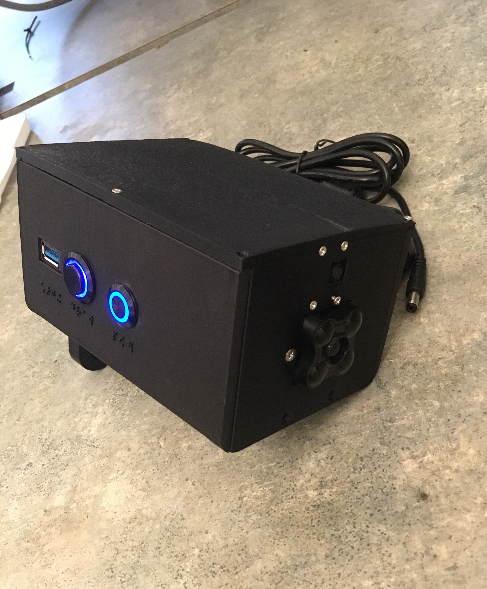
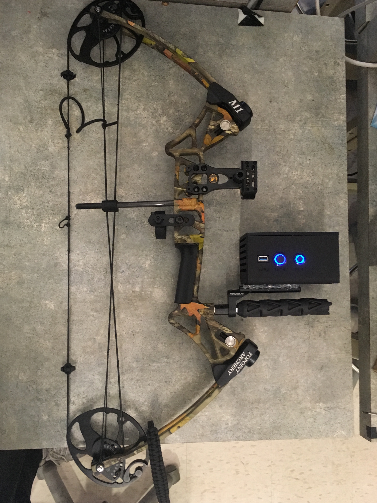
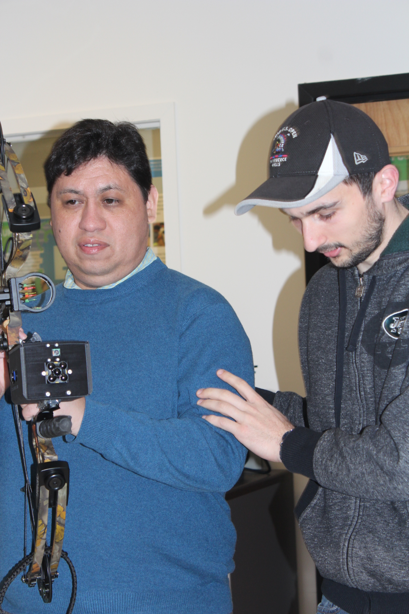
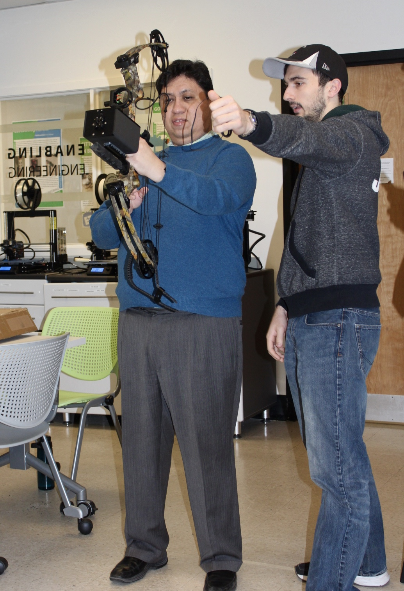
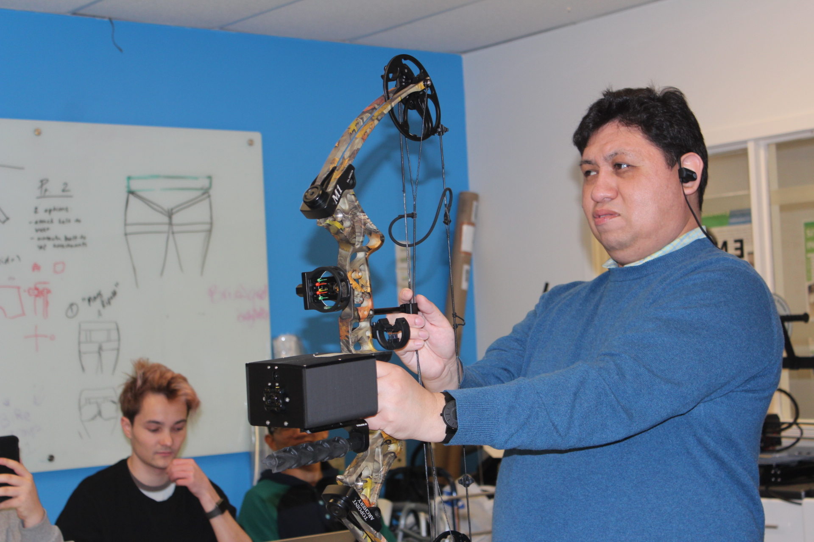

# BAVI

BAVI is a bow and arrow attachment that allows the visually impaired to participate in archery. BAVI uses OpenCV to detect the target, a lidar to detect the distance of the target and bluetooth earphones to provide audio feedback to the user.  


## Getting Started

### Hardware Required
* Raspberry Pi 3 B+
* Raspberry Camera Module
* Terabee Evo Lidar
* Bluetooth Earphones
* Pushbutton

### Software Required
* Python 3 
* Raspian OS
* OpenCV


### Installing


##### Lidar Setup:
```
sudo apt-get install ros-<your_distro>-serial
sudo apt-get install ros-kinetic-teraranger

cd ~/ros_ws/src
git clone git@github.com:Terabee/teraranger.git
cd ~/ros_ws
catkin_make
source devel/setup.bash

rosrun teraranger evo _portname:=/dev/ttyACM0 _sensor_type:=Evo_60m
```

##### Bluetooth Setup:
```
sudo bluetoothctl
agent on
default-agent 
scan on
pair [device Bluetooth address]
```

#### Python 3 Setup:
```
sudo apt-get install python3-dev libffi-dev libssl-dev -y
wget https://www.python.org/ftp/python/3.6.3/Python-3.6.3.tar.xz
tar xJf Python-3.6.3.tar.xz
cd Python-3.6.3
./configure
make
sudo make install
sudo pip3 install --upgrade pip
```

##### OpenCV Setup:
```
sudo apt-get install build-essential cmake pkg-config
sudo apt-get install libjpeg-dev libtiff-dev libjasper-dev libpng12-dev
sudo apt-get install libavcodec-dev libavformat-dev libswscale-dev libv4l-dev
sudo apt-get install libxvidcore-dev libx264-dev
sudo apt-get install libgtk2.0-dev libgtk-3-dev
sudo apt-get install libatlas-base-dev gfortran

sudo apt-get install python3-dev

sudo apt-get install python3-pip
sudo pip3 install numpy scipy

wget -O opencv.zip https://github.com/opencv/opencv/archive/4.0.0.zip
wget -O opencv_contrib.zip https://github.com/opencv/opencv_contrib/archive/4.0.0.zip
unzip opencv.zip
unzip opencv_contrib.zip

cd ~/opencv-4.0.0/
mkdir build
cd build

cmake -D CMAKE_BUILD_TYPE=RELEASE \
    -D CMAKE_INSTALL_PREFIX=/usr/local \
    -D INSTALL_PYTHON_EXAMPLES=ON \
    -D OPENCV_EXTRA_MODULES_PATH=~/opencv_contrib-4.0.0/modules \
    -D ENABLE_NEON=ON \
    -D ENABLE_VFPV3=ON \
    -D WITH_FFMPEG=ON \
    -D WITH_GSTREAMER=ON \
    -D BUILD_EXAMPLES=ON ..

make -j4

sudo make install
sudo ldconfig
sudo apt-get update

sudo reboot
```

## Results


#### Final Design
  &nbsp;&nbsp;&nbsp;&nbsp;&nbsp;&nbsp;&nbsp;&nbsp;&nbsp;&nbsp;&nbsp;&nbsp;&nbsp;&nbsp;&nbsp;&nbsp;   

#### National Braille Press Testing
    

#### Range Testing 
